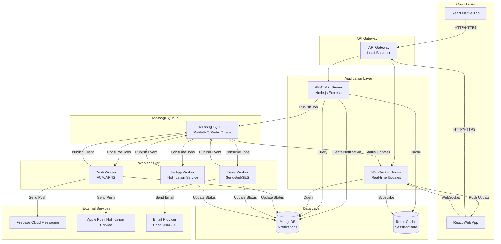

# Task 2: System Architecture

## High-Level Architecture for Notification System

### Architecture Overview

The system is designed to handle high-volume notification delivery with non-blocking operations, real-time updates, and support for both mobile (React Native) and web (React) clients.

---

## Architecture Diagram

---

## Architecture Components

### 1. Client Layer

#### React Native App (Mobile)
- **Communication**: HTTP/HTTPS REST API for fetching notifications
- **Push Notifications**: Receives push notifications via FCM/APNS when app is closed
- **Offline Support**: Local storage/cache for offline access
- **Polling**: Periodic sync when app is in foreground

#### React Web App
- **Communication**: HTTP/HTTPS REST API + WebSocket for real-time updates
- **Real-time**: WebSocket connection for instant notification delivery
- **State Management**: React state/Redux for notification list management

### 2. API Gateway / Load Balancer

**Purpose**: 
- Route requests to appropriate services
- Handle SSL termination
- Rate limiting and authentication
- Load distribution across multiple API instances

**Technology**: Nginx, AWS API Gateway, or Cloudflare

### 3. Application Layer

#### REST API Server (Node.js/Express)
**Responsibilities**:
- Handle notification creation requests
- Fetch notification lists with pagination
- User authentication and authorization
- Query MongoDB for notifications
- Publish notification jobs to message queue (non-blocking)

**Key Endpoints**:
- `POST /api/notifications` - Create notification (async, returns immediately)
- `GET /api/notifications` - List notifications with pagination
- `GET /api/notifications/:id` - Get notification details
- `PUT /api/notifications/:id/read` - Mark as read

**Non-blocking Design**:
- When creating a notification, API immediately saves to DB and publishes jobs to queue
- Returns success response without waiting for channel delivery
- Channel delivery happens asynchronously via workers

#### WebSocket Server
**Responsibilities**:
- Maintain persistent connections with web clients
- Subscribe to notification events from message queue
- Push real-time updates to connected clients
- Handle connection management and reconnection

**Technology**: Socket.io, ws library, or AWS API Gateway WebSocket

### 4. Message Queue

**Purpose**: Decouple notification creation from delivery processing

**Technology**: RabbitMQ, Redis Queue, or AWS SQS

**Queues**:
- `notification.push` - Push notification jobs
- `notification.email` - Email notification jobs
- `notification.in-app` - In-app notification jobs
- `notification.events` - Status update events for WebSocket

**Benefits**:
- Non-blocking API responses
- Retry mechanism for failed deliveries
- Rate limiting per provider
- Horizontal scaling of workers

### 5. Worker Layer

#### Push Notification Worker
- Consumes jobs from `notification.push` queue
- Sends notifications via FCM (Android) and APNS (iOS)
- Updates delivery status in MongoDB
- Publishes status events to `notification.events` queue
- Implements retry logic with exponential backoff

#### Email Worker
- Consumes jobs from `notification.email` queue
- Sends emails via SendGrid, AWS SES, or similar
- Updates delivery status in MongoDB
- Publishes status events to `notification.events` queue
- Handles email template rendering

#### In-App Worker
- Consumes jobs from `notification.in-app` queue
- Updates notification status in MongoDB
- Publishes real-time events to WebSocket via `notification.events` queue
- Handles immediate delivery for in-app notifications

### 6. Data Layer

#### MongoDB
- Stores all notification documents
- Indexed for efficient querying (see Task 1)
- Handles high read/write volumes

#### Redis Cache
- Session management
- Caching frequently accessed notifications
- WebSocket connection state
- Rate limiting counters

### 7. External Services

- **FCM**: Firebase Cloud Messaging for Android push notifications
- **APNS**: Apple Push Notification Service for iOS push notifications
- **Email Providers**: SendGrid, AWS SES, or similar for email delivery

---

## Flow: Notification Creation to Delivery

### Step-by-Step Flow

1. **Client Request**:
   - Mobile/Web app sends `POST /api/notifications` request
   - Request includes: userId, type, title, body, channels

2. **API Processing** (Non-blocking):
   - API validates request
   - Creates notification document in MongoDB with status "pending"
   - Publishes separate jobs to message queue for each channel (push, email, in-app)
   - Returns 202 Accepted immediately with notification ID

3. **Worker Processing** (Asynchronous):
   - Workers consume jobs from respective queues
   - Each worker:
     - Updates channel status to "sent"
     - Calls external provider (FCM/APNS/Email)
     - Updates status to "delivered" or "failed" based on response
     - Publishes status event to `notification.events` queue

4. **Real-time Updates** (Web only):
   - WebSocket server subscribes to `notification.events` queue
   - On status update, pushes event to connected web clients
   - Web app updates UI in real-time

5. **Mobile Push** (When app closed):
   - Push worker sends notification via FCM/APNS
   - Device receives push notification
   - User taps notification → app opens → fetches full notification from API

---

## Scalability Considerations

### Horizontal Scaling
- **API Servers**: Stateless design allows multiple instances behind load balancer
- **Workers**: Multiple worker instances can process queue jobs in parallel
- **WebSocket Servers**: Can scale horizontally with Redis pub/sub for cross-instance communication

### Traffic Spike Handling
- **Message Queue**: Buffers jobs during high traffic, preventing API blocking
- **Worker Auto-scaling**: Workers can scale up/down based on queue depth
- **Database**: Read replicas for read-heavy operations
- **Caching**: Redis cache reduces database load

### Rate Limiting
- Per-user rate limiting at API gateway
- Per-provider rate limiting (FCM/APNS/Email have their own limits)
- Queue-based throttling prevents overwhelming external services

---

## Offline Support

### Mobile App (React Native)
- **Local Storage**: Notifications cached locally using AsyncStorage or SQLite
- **Sync Queue**: Offline actions queued and synced when online
- **Push Notifications**: Work even when app is closed (handled by OS)

### Web App
- **Service Workers**: Cache notifications for offline access
- **WebSocket Reconnection**: Automatic reconnection with message queuing
- **Optimistic Updates**: UI updates optimistically, syncs when connection restored

---

## Error Handling & Retry Logic

### Retry Strategy
- **Exponential Backoff**: Failed deliveries retry with increasing delays
- **Max Retries**: Configurable max retry attempts (e.g., 3-5 retries)
- **Dead Letter Queue**: Failed notifications after max retries moved to DLQ for manual review

### Failure Scenarios
- **Provider Failure**: Worker logs error, updates status to "failed", retries
- **Network Failure**: Worker retries with exponential backoff
- **Invalid Token**: Removes invalid push tokens, marks channel as failed
- **Email Bounce**: Updates status, optionally unsubscribes user

---

## Security Considerations

- **Authentication**: JWT tokens for API authentication
- **Authorization**: User can only access their own notifications
- **Rate Limiting**: Prevents abuse and DoS attacks
- **Input Validation**: Sanitize all user inputs
- **HTTPS/WSS**: Encrypted communication for all client-server interactions

---

## Technology Stack Recommendations

- **Backend**: Node.js with Express/Fastify
- **Message Queue**: RabbitMQ or Redis with Bull/BullMQ
- **Database**: MongoDB with Mongoose ODM
- **Cache**: Redis
- **WebSocket**: Socket.io or ws library
- **Push Notifications**: Firebase Admin SDK (FCM) + node-apn (APNS)
- **Email**: SendGrid SDK or AWS SES SDK
- **Deployment**: Docker containers on Kubernetes or AWS ECS

---

## Monitoring & Observability

- **Logging**: Structured logging (Winston, Pino)
- **Metrics**: Prometheus + Grafana for system metrics
- **Tracing**: Distributed tracing (Jaeger, Zipkin)
- **Alerts**: Alert on queue depth, worker failures, provider errors
- **Dashboards**: Monitor notification delivery rates, latency, error rates
